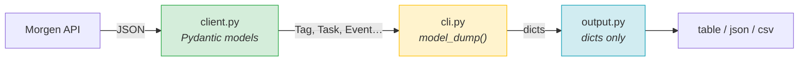

# morgen CLI

Calendar and task management CLI wrapping the Morgen API. Designed for LLM consumption — all commands emit structured JSON.

## Setup & Verification

```bash
uv sync --all-extras && uv run pre-commit install   # first time
uv run pytest -x -q --cov                            # verify: tests + coverage
uv run mypy src/                                     # verify: types
```

Pre-commit hooks enforce everything (ggshield, ruff, mypy, bandit, pytest+cov). Trust the hooks.

## TDD Workflow

1. Write failing test in `tests/`
2. Implement in `src/morgen/`
3. `uv run pytest -x -q` — green
4. `uv run mypy src/` — clean

## Architecture



**The boundary rule:** client returns models, cli converts with `model_dump()`, output only sees dicts.

Deep dive: `docs/models.md` | `docs/testing.md`

## File Map

```
src/morgen/
  cli.py        Click commands — boundary layer (model → dict)
  client.py     MorgenClient — typed API wrapper
  models.py     Pydantic v2 models (MorgenModel base)
  output.py     Render pipeline (table/json/jsonl/csv + fields + jq)
  errors.py     Exception hierarchy → structured JSON on stderr
  config.py     Settings from .env
  time_utils.py Date range helpers
```

## Conventions

- `from __future__ import annotations` in every file
- mypy strict, Pydantic v2, Python 3.10+
- Coverage minimum 90% — enforced by pre-commit
