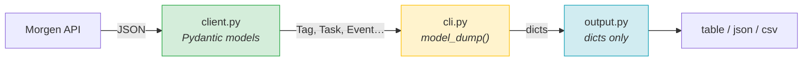

# morgen CLI

Calendar and task management CLI wrapping the Morgen API. Designed for LLM consumption — all commands emit structured JSON.

## Setup & Verification

```bash
uv sync --all-extras && uv run pre-commit install   # first time
cp .env.example .env                                 # then add MORGEN_API_KEY
uv run pytest -x -q --cov                            # verify: tests + coverage
uv run mypy src/                                     # verify: types
uv run morgen usage                                  # CLI self-documentation
```

Pre-commit hooks enforce everything (ggshield, ruff, mypy, bandit, pytest+cov). Trust the hooks.

## TDD Workflow

1. Write failing test in `tests/`
2. Implement in `src/morgen/`
3. `uv run pytest -x -q` — green
4. `uv run mypy src/` — clean

## Architecture



**The boundary rule:** client returns models, cli converts with `model_dump()`, output only sees dicts.

Deep dive: [`docs/models.md`](docs/models.md) | [`docs/testing.md`](docs/testing.md)

## File Map

```
src/morgen/
  cli.py        Click commands — boundary layer (model → dict)
  client.py     MorgenClient — typed API wrapper
  models.py     Pydantic v2 models (MorgenModel base)
  output.py     Render pipeline (table/json/jsonl/csv + fields + jq)
  errors.py     Exception hierarchy → structured JSON on stderr
  config.py     Settings from .env (MORGEN_API_KEY)
  time_utils.py Date range helpers
  cache.py      TTL-based request cache (model_dump → cache → model_validate)
  groups.py     Calendar group filtering from .config.toml
```

## Conventions

- mypy strict, Pydantic v2, Python 3.10+
- Coverage minimum 90% — enforced by pre-commit

## Gotchas

- **`MORGEN_API_KEY`** must be set in `.env` — get it from https://platform.morgen.so/
- **`.config.toml`** controls calendar group filtering — events commands use `default_group` unless `--group all` is passed
- **`morgen.so:metadata`** is a real API field name with a dot — the Event model aliases it. Always use `model_dump(by_alias=True)` for events
- **Mutation output** uses `model_dump(exclude_none=True)` — omitting this floods output with null fields
