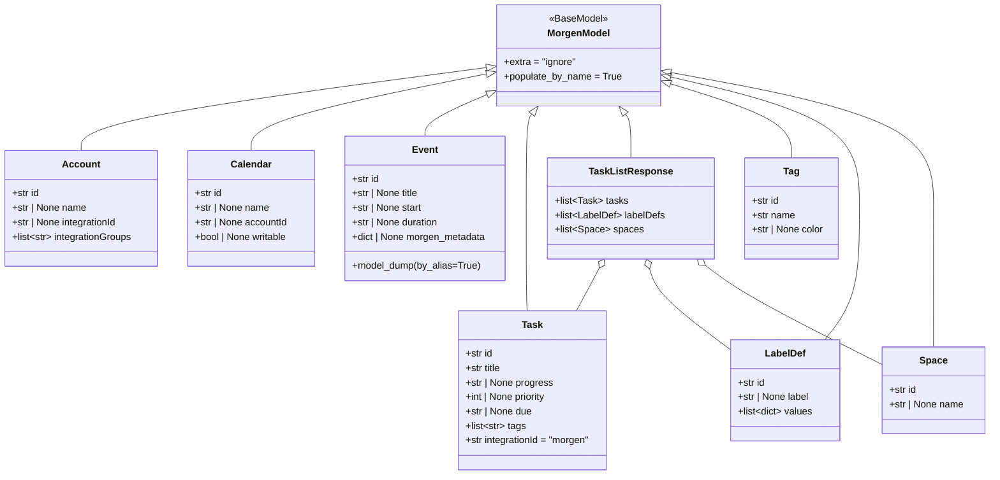
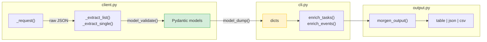
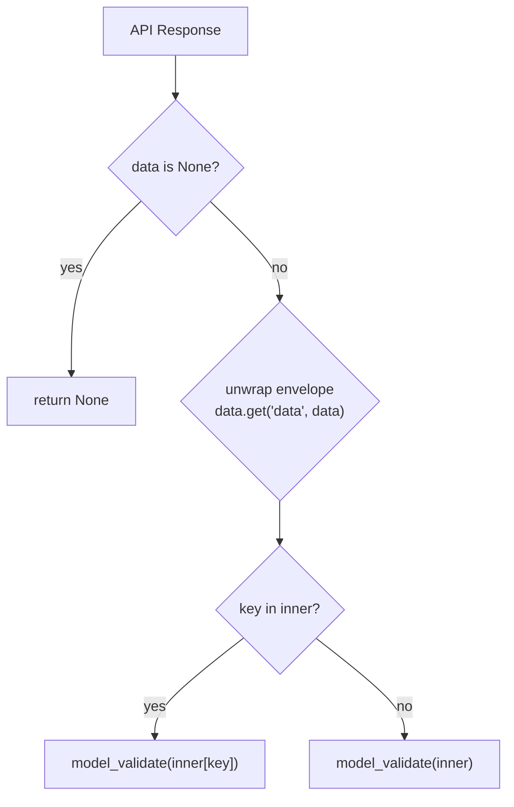
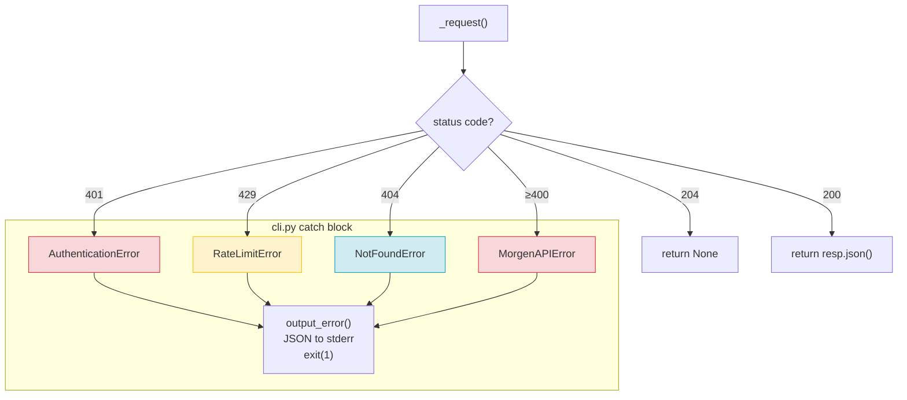
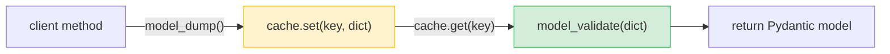
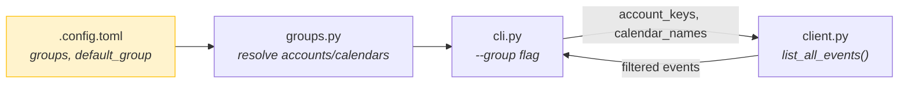

# Pydantic Models & Typing

## Model Hierarchy



### Why `extra="ignore"`

The Morgen API may add new fields at any time. `extra="ignore"` means new fields don't break validation. Drift detection tests (`tests/test_models.py`) flag when new fields appear so models can be updated intentionally.

## The model/dict Boundary



**Rules:**
- `client.py` always returns typed models (`Tag`, `Task`, `Event`, etc.)
- `cli.py` calls `model_dump()` to convert, then passes to output/enrichment
- `output.py` only receives dicts — never Pydantic models

### model_dump() variants

| Pattern | When | Why |
|---------|------|-----|
| `model_dump()` | Default list commands | Standard conversion |
| `model_dump(by_alias=True)` | Events | Preserves `morgen.so:metadata` key name |
| `model_dump(exclude_none=True)` | Mutation results (create/update) | Avoids noisy null fields |

## Field Aliases

The Event model has a field alias for the non-Python-friendly API key:

```python
morgen_metadata: dict[str, Any] | None = Field(None, alias="morgen.so:metadata")
```

- Construction: accepts both `morgen_metadata=` and `morgen.so:metadata=`
- Output: `model_dump()` returns `morgen_metadata`, `model_dump(by_alias=True)` returns `morgen.so:metadata`

## Client Extractors

Two generic extractors unwrap the Morgen API envelope:



- `_extract_list(data, key, model)` → `list[T]` — for list endpoints
- `_extract_single(data, key, model)` → `T | None` — for single-item endpoints (returns `None` for 204/empty)

GET methods raise `NotFoundError` if the result is `None`. Write methods return `T | None`.

## Error Handling



## Cache



- Cache stores raw dicts via `model_dump()`, not Pydantic objects
- Retrieval validates with `model_validate()` — revalidates on every cache hit
- This ensures cached data always passes current model validation

## Calendar Groups & Filtering

Event commands filter through calendar groups defined in `.config.toml`:



- `default_group` in `.config.toml` is used unless `--group all` is passed
- `active_only = true` skips inactive calendars by default
- Groups map to account emails and calendar names, resolved at CLI layer

## Adding a New Model

1. Add the Pydantic model to `src/morgen/models.py` inheriting `MorgenModel`
2. Add client methods in `src/morgen/client.py` using `_extract_list`/`_extract_single`
3. Add CLI command in `src/morgen/cli.py` — call client, `model_dump()`, pass to output
4. If the model has non-Python field names, use `Field(alias=...)` and `model_dump(by_alias=True)`
5. For mutation commands, use `model_dump(exclude_none=True)` on the result
6. Add a JSON fixture in `tests/fixtures/` from a real API response
7. Add drift detection test in `tests/test_models.py`
8. Add CLI tests using `mock_client` fixture (see [`docs/testing.md`](testing.md))
9. Add error path tests in `tests/test_cli_errors.py`
