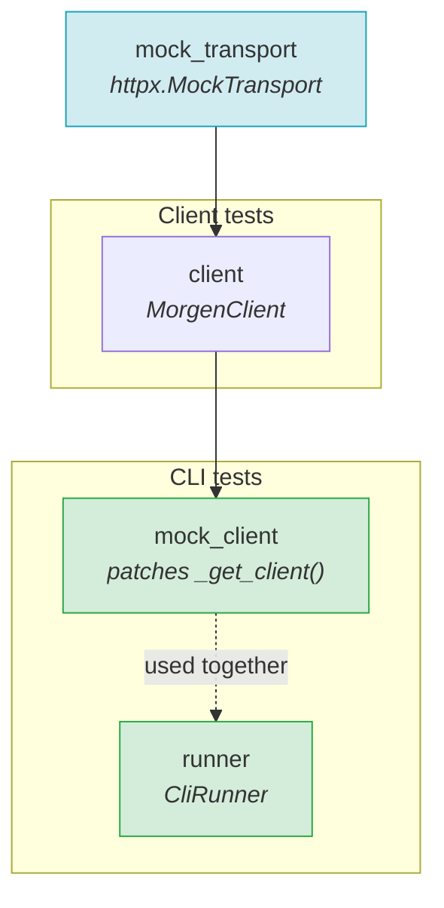
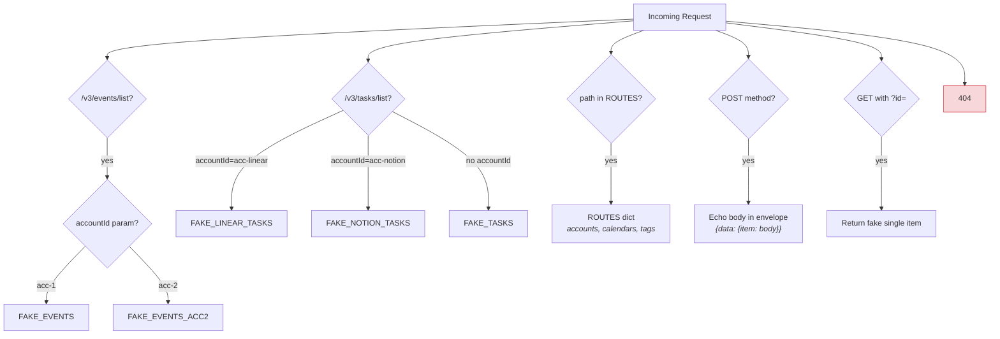
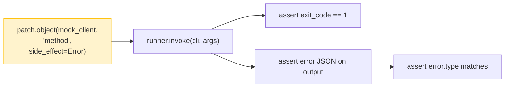
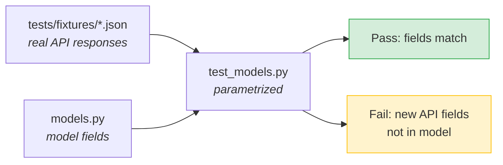

# Testing Guide

## Running Tests

```bash
uv run pytest -x -q              # fast: fail on first error
uv run pytest --cov              # with coverage report
uv run pytest -k "test_name"     # run specific test
```

## Mock Infrastructure

All API tests use `httpx.MockTransport` — no network calls.

### Fixture Dependencies



| Fixture | Type | Purpose |
|---------|------|---------|
| `runner` | `CliRunner` | Click CLI test runner |
| `client` | `MorgenClient` | Client backed by mock transport |
| `mock_client` | `MorgenClient` | Patches `_get_client()` and `load_morgen_config()` so CLI commands use the mock |

### Mock Transport Routing



Key files:
- `tests/conftest.py` — Transport handler, fake data constants (`FAKE_*`), all fixtures
- `tests/fixtures/*.json` — Real API response samples for drift detection

### Adding a new CLI test

```python
def test_my_command(self, runner: CliRunner, mock_client: MorgenClient) -> None:
    result = runner.invoke(cli, ["my-command", "--json"])
    assert result.exit_code == 0
    data = json.loads(result.output)
    # assert on data...
```

### Adding a new client test

```python
def test_my_method(self, client: MorgenClient) -> None:
    result = client.my_method()
    assert isinstance(result, MyModel)
```

## Error Path Testing



Error handling uses `unittest.mock.patch` on client methods:

```python
with patch.object(mock_client, "list_accounts", side_effect=AuthenticationError("msg")):
    result = runner.invoke(cli, ["accounts", "--json"], catch_exceptions=False)
assert result.exit_code == 1
err = json.loads(result.output)
assert err["error"]["type"] == "authentication_error"
```

See `tests/test_cli_errors.py` for the full parametrized error matrix covering all commands.

## API Drift Detection



To update fixtures after confirming new API fields:
1. Capture a real response: `morgen <command> --json > tests/fixtures/<model>_sample.json`
2. Add new fields to the Pydantic model in `src/morgen/models.py`
3. Run `uv run pytest tests/test_models.py -v` to verify
